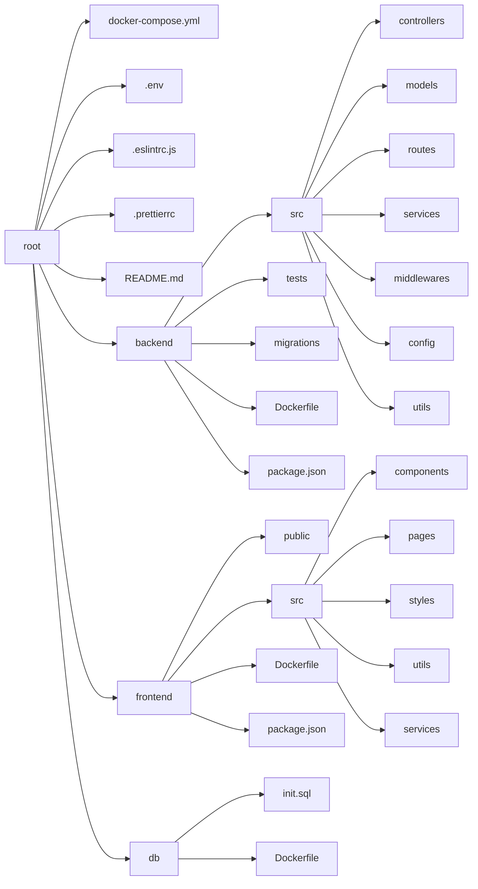

# burndown-chart-app

## ディレクトリ構成

- backend（バックエンド: Express + TypeScript）
  - src/controllers: 各エンドポイントの処理を担当するコントローラ。
  - src/models: データベースモデル。MySQLと連携するために使用。
  - src/routes: APIルーティング定義。各コントローラにルーティングします。
  - src/services: ビジネスロジックやデータベースとのやり取りを行うサービス層。
  - src/middlewares: 認証やエラーハンドリングなど、共通の処理を行うミドルウェア。
  - src/config: 設定ファイルや環境変数を管理。
  - src/utils: 共通処理をまとめるためのユーティリティ関数。
  - tests: ユニットテストやインテグレーションテストを配置。
  - migrations: データベースのマイグレーションファイル。テーブルの作成や更新を管理。
  - Dockerfile: バックエンドのDockerイメージを構築するためのファイル。
  - package.json: バックエンドの依存関係を管理するファイル。
- frontend（フロントエンド: React + TypeScript）
  - public: 公開ディレクトリ。静的ファイル（favicon, index.html など）が含まれる。
  - src/components: フロントエンドのUIコンポーネント。
  - src/pages: 各ページ（ルーティングされるトップレベルのUI）。
  - src/styles: CSSやSassなどのスタイル関連ファイル。
  - src/utils: フロントエンドで共通して使うユーティリティ関数。
  - src/services: APIとの通信などのサービスを担当。
  - Dockerfile: フロントエンド用のDockerイメージを作成するためのファイル。
  - package.json: フロントエンドの依存関係を管理するファイル。
  - db（データベース: MySQL）
  - init.sql: 初期データベースセットアップ用のSQLスクリプト（テーブル作成、初期データ投入など）。
  - Dockerfile: MySQL用のDockerイメージを構築するファイル。

